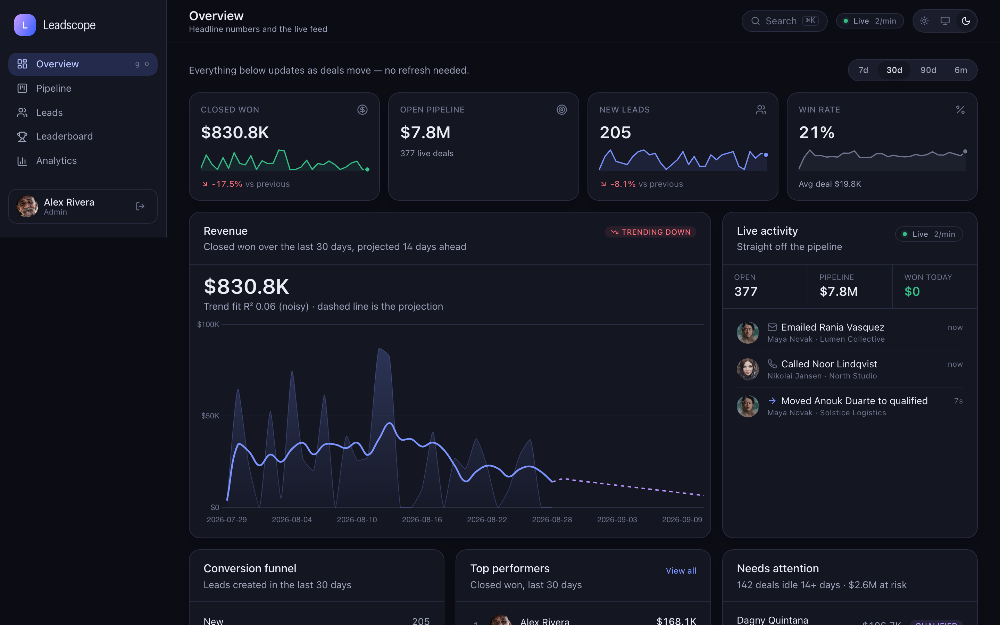
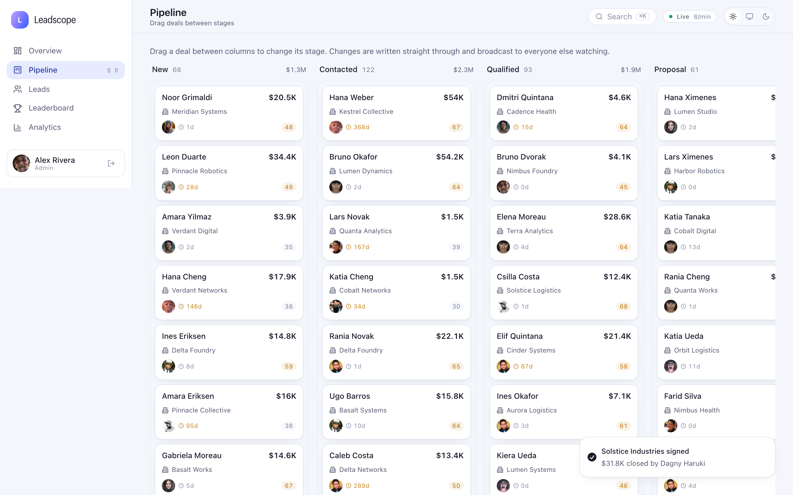
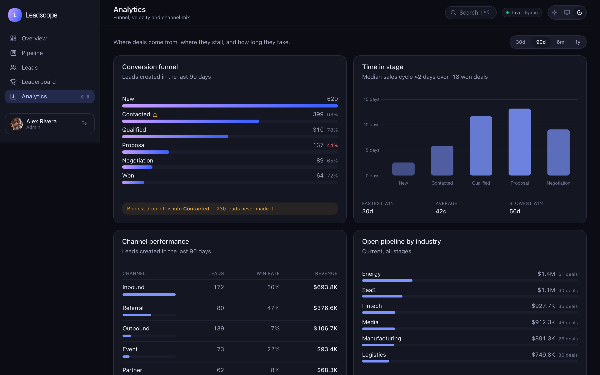

<div align="center">

# Leadscope

**Real-time sales pipeline intelligence.**
A live event stream, a drag-and-drop pipeline, revenue forecasting and team leaderboards —
running on a real backend with a reproducible dataset.

[](https://github.com/paliibo/leadscope/actions/workflows/ci.yml)


**[→ Open the live demo](https://leadscope-demo.vercel.app)** — sign in with
**demo@leadscope.app** / **demo1234**



</div>

---

## What this is

Leadscope is a sales-operations dashboard. It answers the four questions a revenue
team asks every morning:

- **What is happening right now?** A server-sent event stream pushes every touch,
  stage change and closed deal to every connected client as it happens.
- **Where is the money?** An open pipeline broken out by stage, industry and channel,
  with a least-squares projection and an honest confidence band.
- **What is stuck?** Open deals that have not moved in two weeks, biggest first.
- **Who is delivering?** Team ranking by revenue, deals, activity or quota attainment,
  with movement against the previous window.

Everything runs locally against a seeded SQLite database. There is no external service
to sign up for and no API key to obtain: clone, install, run.

```bash
git clone https://github.com/paliibo/leadscope.git && cd leadscope
pnpm install
pnpm dev   # the first start migrates and seeds ~2,400 leads and ~23k activities
```

Then open <http://localhost:3000> and sign in with **demo@leadscope.app** / **demo1234**.

---

## Where it came from

The repository began as a front-end take-home for LinkMe: a
single page that fetched two fixed JSON blobs from jsonbin.io and sorted them in the
browser with a hand-rolled quicksort. It did the job it was set.

This is that exercise rebuilt as a product — a real schema, a real API, a real event
pipeline, and the tests to keep it honest. The brand DNA survived (the purple-to-blue
gradient, the card treatment, the Graphik wordmark); nothing else did.

---

## Features

### Live pipeline feed



A `PipelineSimulator` walks the demo pipeline forward — logging touches, advancing
stages, landing new leads — writing each action to the database _and_ publishing it to
an in-process event bus. `/api/stream` serves that bus over SSE with a replay buffer, so
a client that reconnects with `Last-Event-ID` resumes rather than leaving a hole in the
feed. In production this is exactly where a CRM webhook would plug in; nothing
downstream can tell the difference.

### Drag-and-drop pipeline board

Deals move between stages with `@dnd-kit`. The write is optimistic — the card lands
where it was dropped immediately and rolls back with a toast if the request fails — and
the change is broadcast to everyone else watching the same board.

### Forecasting that admits its own uncertainty



Closed-won revenue is projected with ordinary least squares and a 95% prediction
interval that widens with distance from the sample mean. The card reports the fit
quality next to the projection, and says "noisy" out loud below R² 0.15 — daily revenue
from a fourteen-person team is lumpy, and a forecast that hides that is a lie.

### The rest

|                         |                                                                                                                                       |
| ----------------------- | ------------------------------------------------------------------------------------------------------------------------------------- |
| **Conversion funnel**   | Built from each lead's _furthest reached_ stage, so a lost deal still counts for every step it cleared. Flags its own worst drop-off. |
| **Pipeline velocity**   | Median and mean dwell time per stage, sales-cycle length, and stalled deals ranked by value at risk.                                  |
| **Lead scoring**        | Five weighted components, returned with the breakdown so a rep can see _why_ a lead scored 61.                                        |
| **Leaderboard**         | Competition ranking (1, 2, 2, 4), quota rings, and movement against the previous window.                                              |
| **Command palette**     | ⌘K / Ctrl-K. Debounced server-side lead search, navigation, theme.                                                                    |
| **Keyboard navigation** | `g` then `o`/`p`/`l`/`b`/`a`, suppressed while focus is in an input.                                                                  |
| **CSV export**          | Honours every active filter, RFC 4180 quoted.                                                                                         |
| **Themes**              | Light and dark from one set of CSS custom properties; charts repaint on the switch.                                                   |
| **Auth**                | scrypt password hashing, HS256 session cookies, edge middleware, role-scoped queries.                                                 |

---

## Architecture

```
Browser                          Next.js server                    SQLite / libSQL
────────────────────────────     ─────────────────────────────     ─────────────────

React Query cache  ◄──── JSON ─── Route handlers ──── Drizzle ────►  leads
        ▲                         (zod-validated)                    activities
        │                                │                           accounts
        │ invalidate                     │ publish                   reps · teams · goals
        │                                ▼                                   ▲
  useLiveStream    ◄──── SSE ────── EventBus  ◄──── writes ─── PipelineSimulator
  (EventSource)                    (replay buffer)
```

Three things worth calling out:

**The simulator writes through the same path as a user.** It does not fabricate events
for the UI — it mutates the database and then announces it. That means a page refresh
and the live ticker can never disagree, which is the failure mode every fake "realtime
demo" has.

**Events are coalesced before they hit the cache.** A burst of activity would otherwise
fire a refetch per event. `LiveProvider` batches invalidations into one per query key
per 1.2 s window.

**Reps are scoped at the route boundary, not in the UI.** `canViewAllReps()` decides
whether an `ownerId` parameter is honoured or overridden with the caller's own id, so a
rep cannot widen their view by editing a query string.

More detail in [`docs/architecture.md`](docs/architecture.md), and the reasoning behind
the bigger calls in [`docs/decisions.md`](docs/decisions.md).

---

## Stack, and why

| Choice                       | Reason                                                                                                                                               |
| ---------------------------- | ---------------------------------------------------------------------------------------------------------------------------------------------------- |
| **Next.js 15, App Router**   | Server components for the shell and session, route handlers for the API — one deployable, one language.                                              |
| **Drizzle + libSQL**         | Real SQL with real types and checked-in migrations. A file locally, a Turso URL in production, no code change.                                       |
| **SSE, not WebSockets**      | Traffic is strictly server → client. SSE survives proxies that mangle upgrades and the browser reconnects on its own, with `Last-Event-ID` for free. |
| **TanStack Query**           | The live stream pushes; the cache is the thing being pushed to. Optimistic updates with rollback come with it.                                       |
| **Chart.js**                 | Already proven in the original exercise. Canvas rendering handles a 365-point series without the DOM cost of an SVG chart library.                   |
| **Tailwind + CSS variables** | Themes are a token swap, not a second stylesheet.                                                                                                    |
| **Vitest + Playwright**      | Vitest for the analytics maths, Playwright for the flows a unit test cannot reach — drag-and-drop, SSE, CSV download.                                |

Deliberately _not_ used: no Redux (server state is a cache, not app state), no component
library (the design language came from the original exercise), no ORM-free raw SQL
(migrations and types earn their keep).

---

## Data

The demo dataset is generated, not fixtured — `SEED=20260101` produces the same 14
months every time, on every machine.

|              |                                                 |
| ------------ | ----------------------------------------------- |
| Leads        | ~2,400 across 7 stages                          |
| Activities   | ~23,000 touches, stage changes and closes       |
| Accounts     | 140 companies across 9 industries               |
| Reps         | 14 across 4 regional teams, with monthly quotas |
| Win rate     | ~20% of closed deals                            |
| Median cycle | ~42 days, creation to close                     |

Each lead walks the pipeline stage by stage, with advance odds modified by rep skill and
channel quality and log-normal dwell times between transitions. Roughly a third of
deals that fail to advance go quiet rather than dying, and most of those are swept up in
a hygiene pass 35–95 days later. Arrivals follow a growth trend with weekday and
seasonal dips.

That detail is not decoration. Without it the charts read as noise around a flat line,
the funnel converts uniformly, and the velocity report has nothing to find.

```bash
pnpm db:stats   # pipeline by stage, revenue by month, channel win rates
pnpm db:reset   # wipe and regenerate
```

---

## Commands

| Command              | What it does                               |
| -------------------- | ------------------------------------------ |
| `pnpm dev`           | Dev server on :3000                        |
| `pnpm db:setup`      | Apply migrations, then seed                |
| `pnpm db:reset`      | Delete the local database and rebuild it   |
| `pnpm db:generate`   | Generate a migration from a schema change  |
| `pnpm db:studio`     | Drizzle Studio                             |
| `pnpm db:stats`      | Print a health summary of the current data |
| `pnpm test`          | Unit tests                                 |
| `pnpm test:coverage` | Unit tests with coverage thresholds        |
| `pnpm e2e`           | Playwright, desktop and mobile             |
| `pnpm verify`        | Types, lint and unit tests — what CI runs  |
| `pnpm screenshots`   | Regenerate the images in this README       |

---

## Testing

**198 unit tests** cover the code where a wrong answer is silent: regression and
forecasting, funnel maths, dwell times, ranking, scoring, the event bus, password
hashing and session verification, and every request schema. They assert properties, not
snapshots — funnel counts never increase down the funnel, no feature combination pushes
a score outside 0–100, a tie in the leaderboard breaks the same way regardless of input
order. Four of them are integration tests that boot a throwaway database from nothing —
the directory is created, the migrations run, the seed lands, and a second boot leaves
it alone.

**24 end-to-end tests** cover what a unit test cannot: the drag actually persists across
a reload, the SSE stream actually connects, the CSV actually matches the active filters,
and no page scrolls sideways at 375px.

Both run in CI on every push, alongside a production build.

---

## Deployment

The server looks after its own database. On every start it applies pending migrations,
and if it finds nothing in the tables it seeds the deterministic dataset — about a
second of work. A container on a blank volume, a serverless cold start and a fresh clone
all come up the same way, with no runbook. `DB_BOOTSTRAP=0` turns this off for a
database you would rather manage by hand.

**Docker**

```bash
docker compose up --build
```

Multi-stage, non-root, traced standalone output, health-checked against `/api/health`,
with the database on a named volume.

**Vercel** — where the [live demo](https://leadscope-demo.vercel.app) runs

```bash
vercel --prod
```

with `DATABASE_URL=file:/tmp/leadscope.db` and a real `AUTH_SECRET` on the project. Each
function instance seeds its own copy on cold start and keeps it for as long as the
instance lives, so state is per instance and resets now and then — honest enough for a
demo, and it keeps the deployment free of any external service. For state that has to
last, point `DATABASE_URL` at a [Turso](https://turso.tech) database and set
`DATABASE_AUTH_TOKEN`; libSQL speaks to a file and to a remote database through the same
client, so nothing else changes.

Set `LIVE_SIMULATOR=0` in any environment where you do not want the demo pipeline
moving on its own.

---

## Project layout

```
src/
├── app/
│   ├── (dashboard)/          overview · pipeline · leads · leaderboard · analytics
│   ├── api/                  route handlers, including the SSE stream
│   └── login/
├── components/
│   ├── ui/                   primitives: card, button, sparkline, stat tile
│   ├── charts/               themed Chart.js wrappers
│   ├── layout/               shell, sidebar, command palette, live ticker
│   └── {overview,pipeline,leads,leaderboard,analytics}/
├── db/
│   ├── schema.ts             six tables, indexed for the queries that exist
│   ├── bootstrap.ts          migrate, then seed if empty — scripts and boot hook alike
│   └── queries/              every SQL query in the app
├── lib/
│   ├── analytics/            forecast · funnel · velocity · scoring · ranking
│   ├── auth/                 scrypt hashing, JWT sessions
│   ├── demo/                 the deterministic dataset generator
│   ├── events/               event bus and pipeline simulator
│   └── validation/           zod schemas for every request shape
├── instrumentation.ts        boot hook: the database is ready before the first request
└── middleware.ts             edge session gate
```

---

## Licence

MIT — see [LICENSE](LICENSE).
